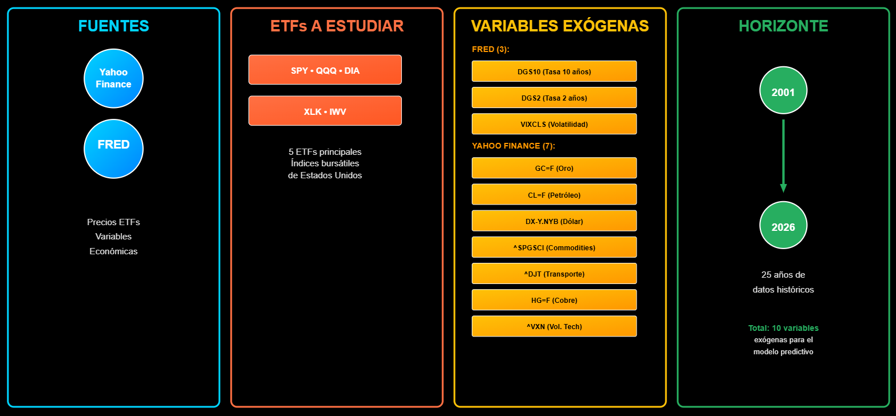
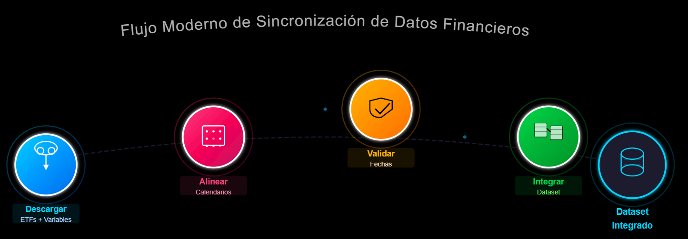
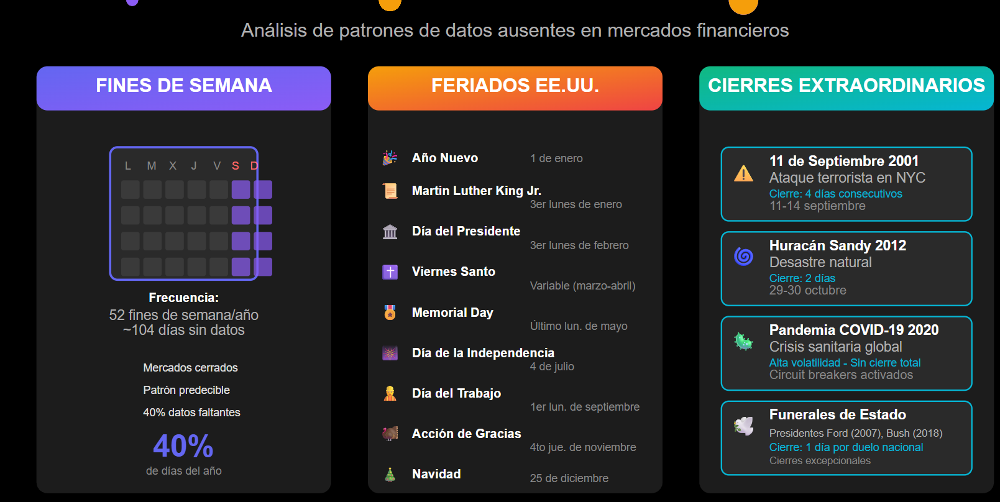
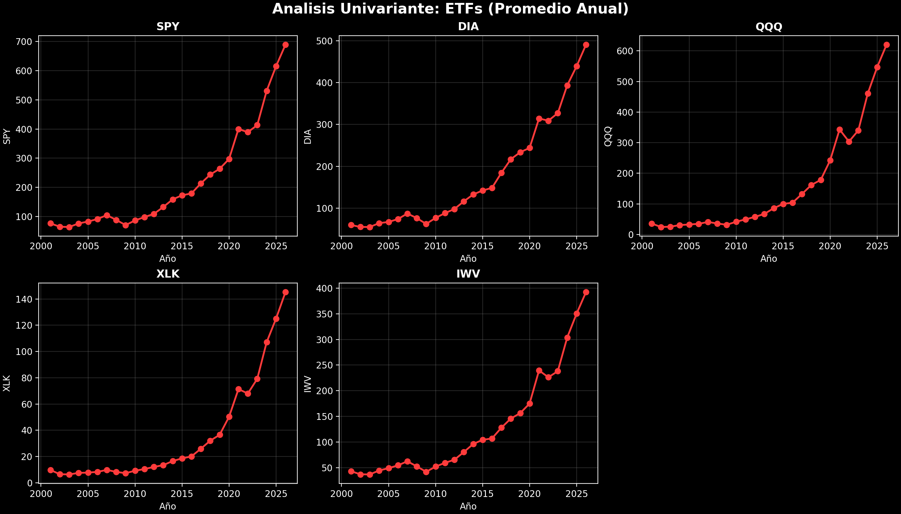
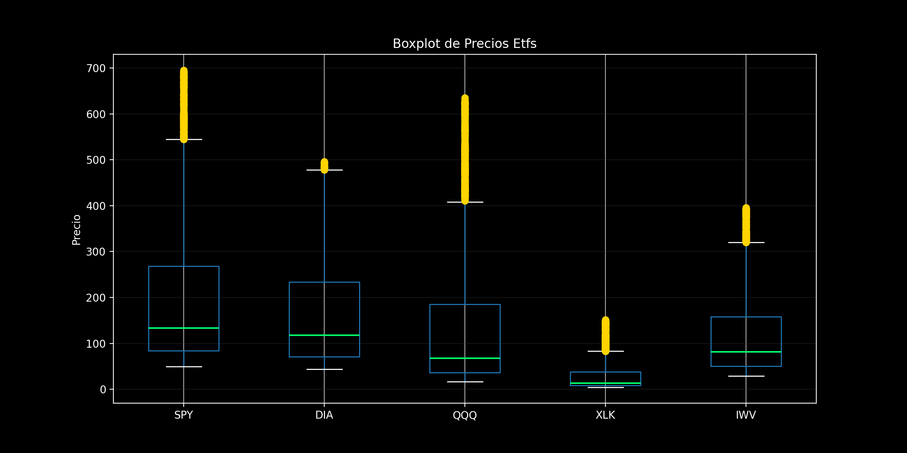
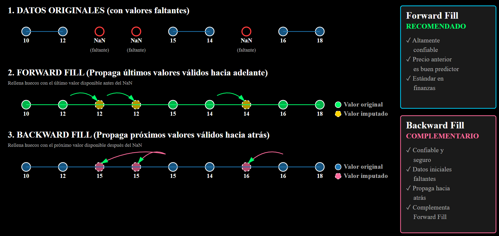
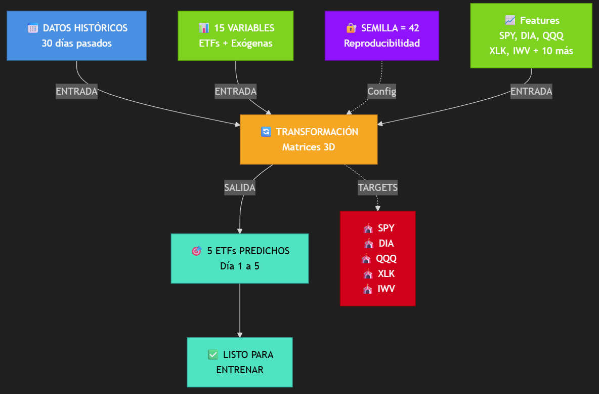
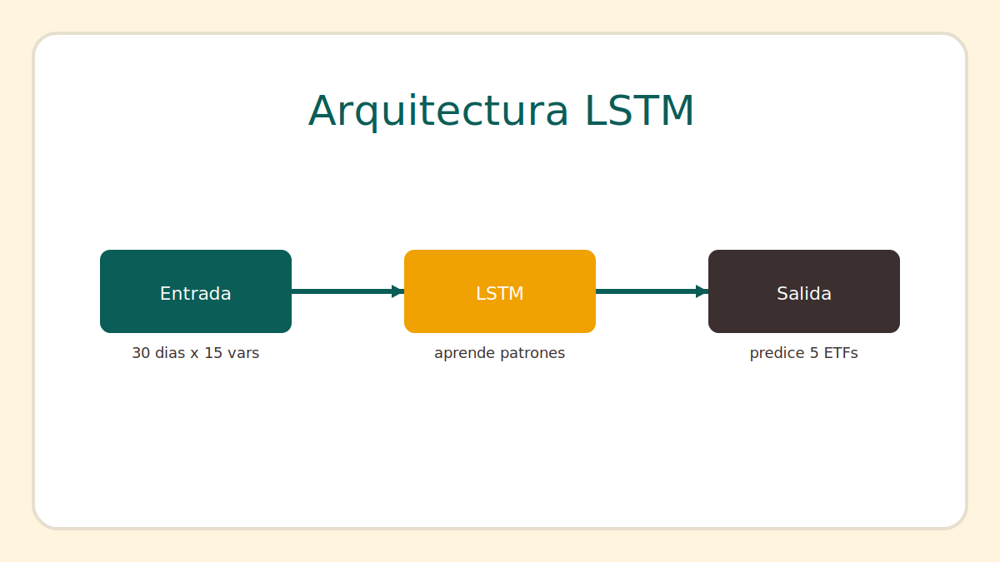
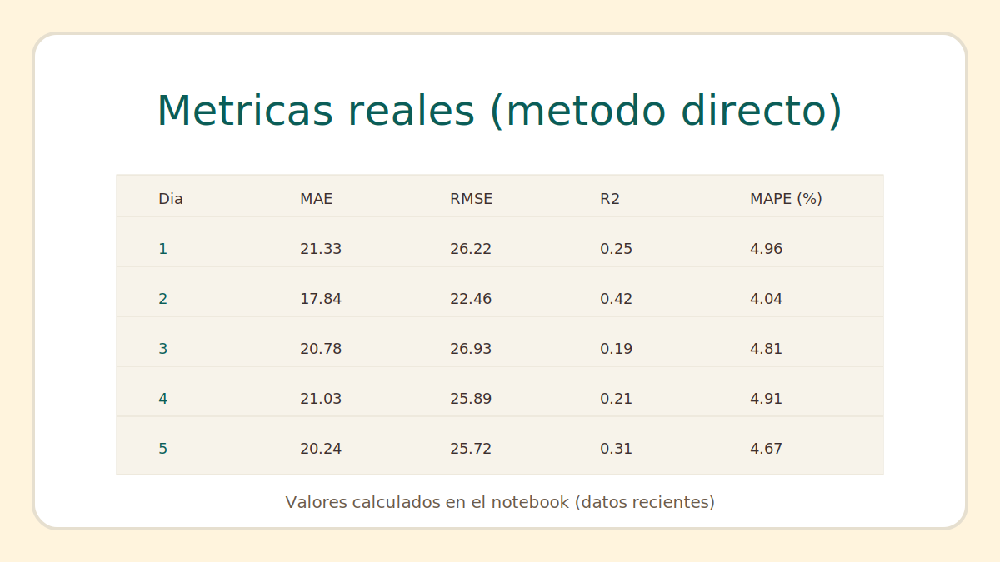

# CJC FINANZAS
## Predicción de ETFs

- Objetivo: Estimar precios a 5 días
- Público: No técnico

<strong>Autores:</strong> 
Catherine Cazorla 
Jesús Jiménez 
Carlos Mairena

---

# Flujo de Trabajo

---

# Fuentes de Datos y Variables

 

---

# Integración del Dataset

- Unir ETFs + Variables Exógenas
- Calendario y Trazabilidad de Fechas

---

# Causas de Datos Faltantes

---

# Análisis Univariante

---

# Análisis de Outliers

---

# Métodos de Imputación

- Forward Fill - Backward Fill

---

# Preparación de Datos Para Modelos

---

# Modelado (LSTM)

- Modelos directos por dia
- Datos recientes (5 anos)

---

# Evaluacion y validacion

- MAE, RMSE, R², MAPE
- Walk-forward y validacion cruzada

---

# Entrega de predicciones

- 5 dias laborales
- Resumen por ETF

