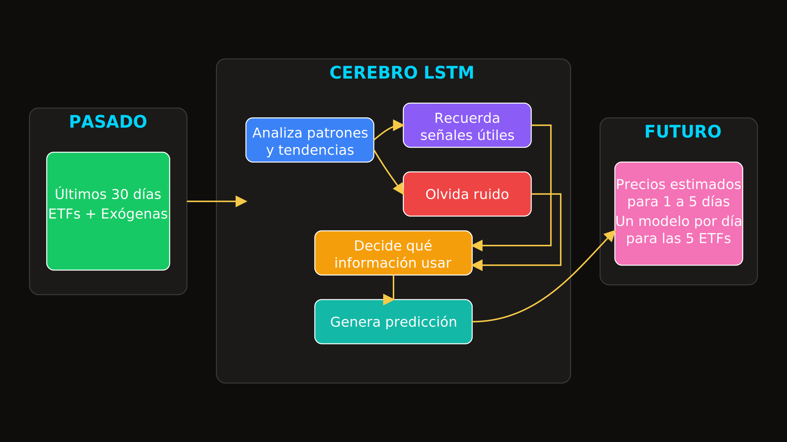
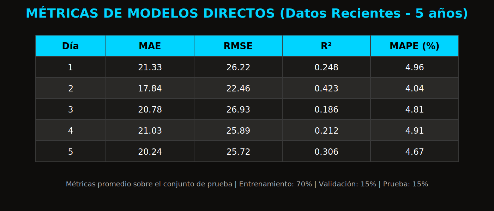
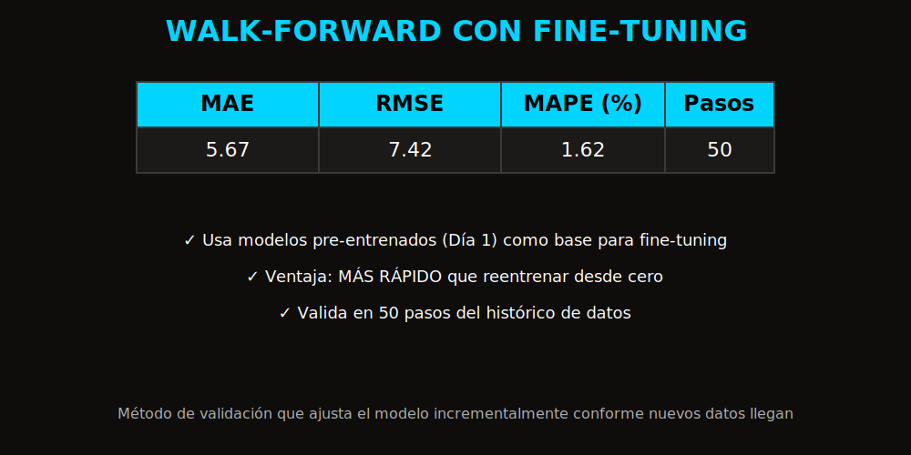

# CJC FINANZAS

- Objetivo: Estimar precios a 5 días
- Público: No técnico

<strong>Autores:</strong> 
Catherine Cazorla 
Jesús Jiménez 
Carlos Mairena

---

# Flujo de Trabajo

---

# Fuentes de Datos y Variables

 

---

# Integración del Dataset

- Unir ETFs + Variables Exógenas
- Calendario y Trazabilidad de Fechas

---

# Causas de Datos Faltantes

---

# Análisis Univariante

---

# Análisis de Outliers

---

# Métodos de Imputación

- Forward Fill - Backward Fill

---

# Preparación de Datos Para Modelos

---

# Modelado (LSTM)
- Modelos Directos por Día
- Datos Recientes (5 años)

---

# Evaluación y Validación

- Un modelo LSTM por día (horizonte 1 a 5)
- Métricas Obtenidas

---

# Validación Walk-Forward

Método de comprobación temporal que simula predicciones en tiempo real. El modelo se entrena con datos históricos y se valida en seguimiento incremental. Cada paso "camina hacia adelante" incorporando nuevos datos y re-entrenando

---

# Entrega de predicciones

- 5 dias laborales
- Resumen por ETF

